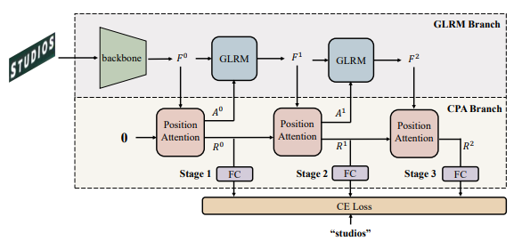

# Linguistic More: Taking a Further Step toward Efficient and Accurate Scene Text Recognition

The official code of [LPV](https://arxiv.org/abs/2305.05140v2)

LPV proposes a Cascade Position Attention (CPA) strategy and a Global Linguistic Reconstruction Module to aggregate linguistic information in both query and features. The pipeline is shown in the following figure.



## ToDo List

- [x] Release code
- [x] Document for Installation
- [x] Document for testing and training
- [x] Trained models
- [ ] Chinese implementation

## Install requirements

- This work was tested with PyTorch 1.7.0, CUDA 10.1, python 3.6 and Ubuntu 16.04. 

- To install other dependencies:

  ```bash
  pip install -r requirements.txt
  ```

## Datasets

- Download lmdb dataset from [Scene Text Recognition with Permuted Autoregressive Sequence Models](https://github.com/baudm/parseq).

- The structure of data folder as below.

    ```bash
    dataset
    ├── evaluation
    │   ├── CUTE80
    │   ├── IC13_857
    │   ├── IC15_1811
    │   ├── IIIT5k
    │   ├── SVT
    │   └── SVTP
    ├── training
    │   ├── MJ
    │   │   ├── MJ_test
    │   │   ├── MJ_train
    │   │   └── MJ_valid
    │   └── ST
    ```

## Pretrained Models

Available model weights:

| Tiny | Small  | Base |
| :---: | :---: | :---: |
| [best_tiny_model](https://drive.google.com/file/d/1nz4kRl6rVzaExGMiFmIED4rYKsjEJ48x/view?usp=sharing) |   [best_small_model](https://drive.google.com/file/d/1uNb4QSyRp4ClXpOJj1iMBWXIbvl2-YTu/view?usp=sharing)   | [best_base_model](https://drive.google.com/file/d/1nE-yQL25MPFObgn6Kpdy6p2YbepYw--6/view?usp=sharing) |

## Train

The training is divided into two stages. 4 3090 GPUs are used in this implementation.

Stage 1 (w/o mask in GLRM)

```bash
CUDA_VISIBLE_DEVICES=0,1,2,3 python3 -m torch.distributed.launch --nproc_per_node=4 --nnodes=1 --master_port 29501 train_final_dist.py \
--isrand_aug --backbone svtr_tiny --trans_ln 2 --exp_name svtr-tiny-exp \
--batch_size 96 --num_iter 413940 --drop_iter 240000
```

Stage 2 (with mask in GLRM)

```bash
CUDA_VISIBLE_DEVICES=0,1,2,3 python3 -m torch.distributed.launch --nproc_per_node=4 --nnodes=1 --master_port 29501 train_final_dist.py \
--isrand_aug --backbone svtr_tiny --trans_ln 2 --exp_name svtr-tiny-exp-mask \
--batch_size 96 --num_iter 413940 --drop_iter 240000 \
--mask --saved_model [dir_to_checkpoint_of_the_first_stage]
```

Explanation of parameters:

```
--backbone：	Can be choosed in [svtr_tiny, svtr_small, svtr_base]
--trans_ln：	The layer of number in GLRM. We set to 2 in LPV-Tiny and 3 in LPV-Small and  LPV-Base.
--exp_name：	The name of experiment folder to save logs and checkpoints.
--batch_size：	The batch size of each GPU. Default is 96.
--num_iter：	The total steps in training. Default is 413940, which equals to 10 epoches when training on MJ and ST.
--drop_iter：	The drop position. Default is 240000.
--mask：	Whether to use mask in GLRM.
--saved_model：	Resume the training.
--imgH:		The height of input image.
--imgW:		The width of input image.
```

**The image size is set to 48*160 for LPV-Base, so it is necessary to add two parameters: --imgH 48 and --imgW 160 when training.**

## Evaluation

```bash
CUDA_VISIBLE_DEVICES=0 python test_final.py --benchmark_all_eval \
--exp_name [the_exp_name] --backbone svtr_tiny --trans_ln 2 \ 
--model_dir [dir_to_your_checkpoint] --eval_data [dir_to_your_evaluated_data] \
--batch_size 96 --mask --show attn --fast_acc
```

Explanation of parameters:

```
--exp_name：	The name of experiment folder.
--backbone：	Can be choosed in [svtr_tiny, svtr_small, svtr_base]
--trans_ln：	The layer of number in GLRM. We set to 2 in LPV-Tiny and 3 in LPV-Small and  LPV-Base.
--model_dir：	The direction of the checkpoint.
--eval_data：	The direction of the evaluated data.
--fast_acc：	To test on six benchmarks.
```

## Citation

If you find our method useful for your reserach, please cite

```
@article{zhang2023linguistic,
  title={Linguistic More: Taking a Further Step toward Efficient and Accurate Scene Text Recognition},
  author={Zhang, Boqiang and Xie, Hongtao and Wang, Yuxin and Xu, Jianjun and Zhang, Yongdong},
  journal={arXiv preprint arXiv:2305.05140},
  year={2023}
}
```

## Acknowledgements

This implementation has been based on these repository [CLOVA AI: deep text recognition benchmark](https://github.com/clovaai/deep-text-recognition-benchmark), [Advanced Literate Machinery: MGP-STR](https://github.com/AlibabaResearch/AdvancedLiterateMachinery/tree/main/OCR/MGP-STR)

### Feedback

Suggestions and discussions are greatly welcome. Please contact the authors by sending email to `cyril@mail.ustc.edu.cn`
